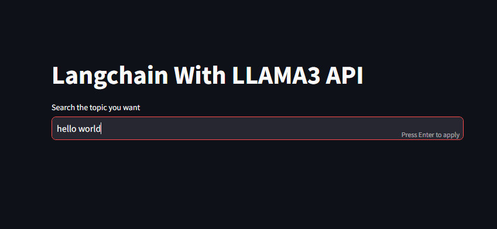

# Chatbot Using Open Source LLM's using Langchain And Ollama

This project aims to develop a chatbot using open source language models (LLM's) such as Langchain and Ollama. The chatbot will be designed to provide intelligent responses and engage in natural language conversations with users.

## Features

- Utilizes open source LLM's for natural language processing
- Supports multi-turn conversations
- Provides intelligent responses based on user input
- Can be easily integrated into existing applications or platforms

## Installation

1. Clone the repository: `git clone https://github.com/sharjeel-siddiqui12/Chatbot-Using-Open-Source-LLM-s-using-Langchain-And-Ollama.git`
2. Navigate to the project directory: `Chatbot-Using-Open-Source-LLM-s-using-Langchain-And-Ollama`
3. Install the required dependencies: `pip install`
4. Run the application: `streamlit run app.py`

## Usage

1. Start the chatbot application by running `streamlit run app.py`
2. Access the chatbot interface through your preferred web browser
3. Enter your message in the input field and press Enter to send
4. The chatbot will process your message and provide a response

## Screenshots

## Contributing

Contributions are welcome! If you would like to contribute to this project, please follow these steps:

1. Fork the repository
2. Create a new branch: `git checkout -b feature/your-feature`
3. Make your changes and commit them: `git commit -m 'Add your feature'`
4. Push to the branch: `git push origin feature/your-feature`
5. Submit a pull request

